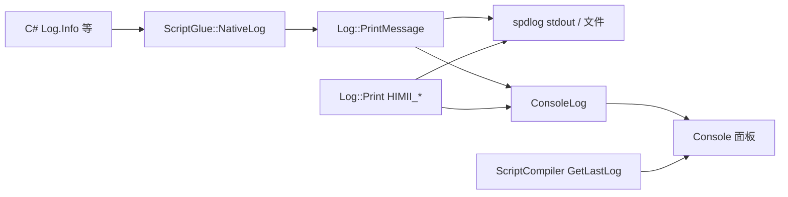

# 日志数据流

本文档描述引擎、脚本运行时日志与 C# 编译输出如何汇入编辑器 **Console**。面向贡献者。

---

## 1) 数据流

- 引擎内部 `HIMII_*` 宏走 `Log::Print`：终端 / 日志文件带源码位置；**Console 只显示短句**（`Source` 为 `Engine`）。
- 脚本侧经 `NativeLog` → `Log::PrintMessage`，`Source` 为 `Script`。
- C# 编译输出仍由 `ScriptCompiler` 持有，不写入 `ConsoleLog`。Play 时 `ConsoleLog::Clear` **不会**清掉最近一次编译结果。

---

## 2) Console 面板

单一窗口 **Window → Console**，通道过滤：

- **Script**：脚本 `Log`（默认开）
- **Compile**：`dotnet build` 输出；error 行可点进 IDE（默认开）
- **Engine**：引擎日志（默认开，但只显示 Warning / Error）
- **Engine Info / Trace**：引擎 Info / Trace（默认关）

---

## 代码索引

- `Engine/src/EngineCore/Core/Log.*`
- `Engine/src/EngineCore/Core/ConsoleLog.*`
- `Engine/src/Module/Script/ScriptGlue`（`NativeLog`）
- `Engine/src/Module/Script/ScriptCompiler`
- `HimiiEditor/src/panel/ConsolePanel.*`
