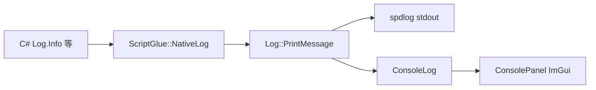

# 日志数据流

本文档描述引擎与脚本日志如何汇入编辑器 Console。面向贡献者。

---

## 1) 数据流

- 引擎内部 `HIMII_*` 宏走 `Log::Print`（带源码位置），也会写入 `ConsoleLog`（source 多为 `Engine`）。
- 脚本侧经 `NativeLog` → `Log::PrintMessage`，source 多为 `Script`。

---

## 2) Console 面板

- 默认过滤偏向脚本消息；可勾选 **Show Engine Logs** 查看引擎日志。
- Play 开始时 `EditorLayer::StartScenePlay` 会 `ConsoleLog::Clear`。

---

## 代码索引

- `Engine/src/EngineCore/Core/Log.*`
- `Engine/src/EngineCore/Core/ConsoleLog.*`
- `Engine/src/Module/Script/ScriptGlue`（`NativeLog`）
- HimiiEditor Console 面板
