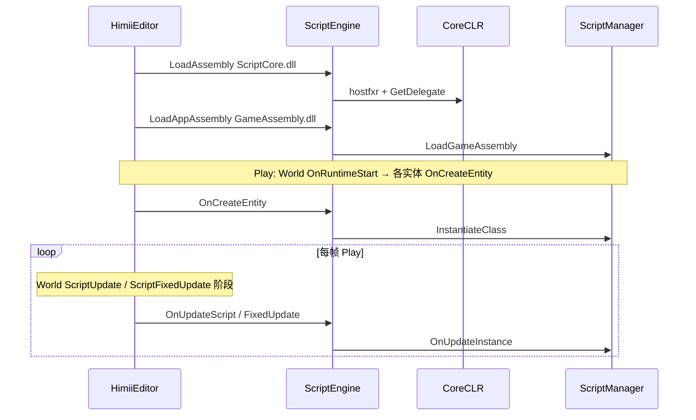

# 脚本系统（C++ 宿主）

本文档描述引擎侧脚本宿主与编辑器加载链。C# API 面向游戏作者，见 [脚本 API](../../UserManual/ScriptingAPI.md) 与 [脚本工作流](../../UserManual/ScriptWorkflow.md)。

---

## 1) 组件位置

| 层 | 路径 / 程序集 | 职责 |
|----|----------------|------|
| Application 模块 | `Module/Script/ScriptModule` | 与进程同寿的宿主初始化 |
| World 模块 | `ScriptUpdateModule` / `ScriptFixedUpdateModule` | 按阶段调用实体脚本 Update / FixedUpdate |
| 实现 | `ScriptEngine`、`ScriptGlue`、`ScriptCompiler`、`ScriptIDELauncher` | CoreCLR、native 互操作、编译、IDE |
| C# | `ScriptCore` | Entity、Input、Log、`InternalCalls` |
| 游戏 | 项目 `GameAssembly` | 用户脚本类 |

---

## 2) 加载与调用链

`ScriptGlue` 填充 native 函数表，经 `InternalCalls.Initialize` 绑定到 C# 委托（含日志、Transform、Input、Physics2D 等）。

打开项目时：若 `GameAssembly.dll` 较新则直接加载，否则 `dotnet build` 再加载（见 `EditorLayer::OpenProject`）。

---

## 3) 与 World 阶段的关系

- **ScriptUpdate**：变量步，对应游戏 `OnUpdate`。
- **ScriptFixedUpdate**：与物理等固定步相关的脚本回调。
- Play 模式下由 `World::OnUpdateRuntime` 显式调用对应阶段；Simulate 不跑完整 ScriptUpdate 路径（见 [编辑器运行时](EditorRuntime.md)）。

---

## 代码索引

- `Engine/src/Module/Script/`
- `ScriptCore/`（C#）
- 场景中的 `ScriptComponent` 序列化见 [场景序列化](Serialization.md)
